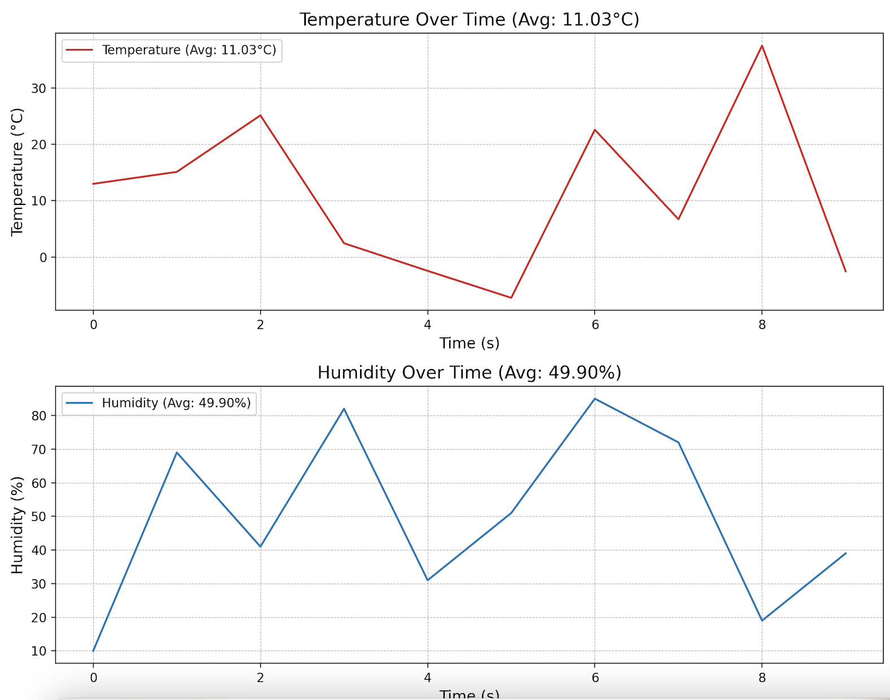

# Real-Time Weather Data Streaming & Visualization

## Project Overview

This project analyzes **real-time weather data**, focusing on **temperature** and **humidity levels** sourced from a streaming platform (Apache Kafka). It provides a **live weather monitoring system** for a specific region, generating alerts based on threshold values, and dynamically visualizing temperature and humidity changes.

### Key Features
- **Real-time streaming of weather data** via Kafka.
- **Data processing** for calculating rolling averages and monitoring thresholds.
- **Dynamic visualization** of live temperature and humidity changes.
- **Threshold-based alerts** for extreme weather conditions.

## Focus

The primary goal of this project is to monitor **real-time weather conditions** by analyzing temperature and humidity data streams. The system processes the streams, provides live alerts when thresholds (e.g., high temperature or low humidity) are exceeded, and visualizes the data in real-time through interactive plots.

## Technology Stack

- **Apache Kafka**: Handles real-time data streaming. Kafka is scalable and robust, making it easy to add additional data sources or consumers.
- **Python**: The core programming language for both the **Producer** and **Consumer** components.
- **Matplotlib**: Used for **dynamic visualization** of real-time data in time series charts.
- **JSON**: Data format for streaming weather information, including **temperature** and **humidity** values.
- **Kafka**: Messaging platform to stream the data between producer and consumer.

## Set Up Kafka

Ensure Kafka and Zookeeper are running on your local machine:

1. **Start Zookeeper**:
    ```
    brew services start zookeeper
    ```

2. **Start Kafka**:
    ```
    brew services start kafka
    ```

## Set Up Virtual Environment

1. Create a virtual environment using Python 3.11:
    ```
    python3.11 -m venv .venv
    ```

2. Activate the virtual environment:
    ```
    source .venv/bin/activate
    ```

3. Install the required dependencies:
    ```
    pip install -r requirements.txt
    ```

## Running the Producer and Consumer

Once you've set up the virtual environment and installed dependencies, you can run the producer and consumer.

### Running the Producer:

1. Start the **Producer** to generate random weather data and stream it to Kafka:
    ```
    source .venv/bin/activate
    python3.11 producers.py
    python3.11 "/Users/katehuntsman/Documents/Streaming Data/streaming-weather-data-huntsman/producers/producers.py"

    ```

### Running the Consumer:

2. Start the **Consumer** to process the data, compute rolling averages, and visualize the data in real-time:
    ```
    source .venv/bin/activate
    python3.11 consumers.py
    python3.11 "/Users/katehuntsman/Documents/Streaming Data/streaming-weather-data-huntsman/consumers/consumers.py"
    ```

## Data Flow Overview

### Producer:

- The **Producer** generates random weather data (timestamp, temperature, humidity) in **JSON** format.
- It streams this data to **Kafka** every 5 seconds.

### Consumer:

- The **Consumer** reads the data from Kafka, processes it, and visualizes it in real-time.
- For each new message, it:
  - Computes rolling averages for **temperature** and **humidity** over the last 10 data points.
  - Checks if the data exceeds the defined thresholds (e.g., temperature > 30°C, humidity < 20%).
  - Generates visual updates based on the data.

## Dynamic Visualization of Weather Data:

The **real-time weather data visualization** dynamically displays **temperature** and **humidity** over time. As new data is streamed in, the charts update to reflect the most recent values, showing how the temperature and humidity change in real-time.

### Key Features of the Visualization:

- **Temperature Plot**: The red line represents the temperature (°C) over time. It dynamically updates every 5 seconds to show the latest temperature value.
- **Humidity Plot**: The blue line represents the humidity (%) over time. Like the temperature plot, it updates every 5 seconds.
- **Real-Time Updates**: Both plots update in real-time as new data is processed by the consumer.
- **Threshold Alerts**: If the temperature exceeds 30°C or the humidity drops below 20%, alerts are shown in the console, and these thresholds are reflected in the plots.

### Visualization Screenshot:

Below is a screenshot of the dynamic weather visualization showing the **temperature** and **humidity** trends:



The **temperature** plot (red line) and **humidity** plot (blue line) demonstrate how the system visualizes the data in real-time as it streams from Kafka.

### Insights from the Visualization:

- **Real-Time Monitoring**: This visualization enables monitoring of temperature and humidity over time, providing immediate insights into weather trends.
- **Alert Awareness**: The alert notifications for extreme temperature and humidity values provide real-time awareness of weather anomalies.

## Future Enhancements

- **SMS/Email Alerts**: For critical threshold breaches, an SMS or email notification system can be added.
- **More Data Sources**: Additional data streams (e.g., wind speed, pressure) could be integrated for more detailed weather monitoring.
- **Data Storage**: Integrating a database to store historical weather data for long-term analysis could be a future goal.
